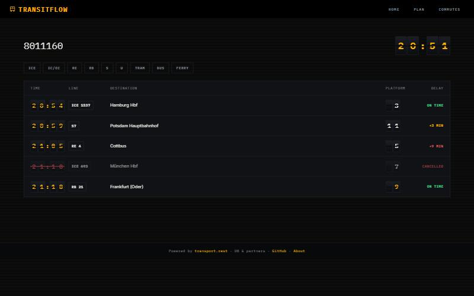
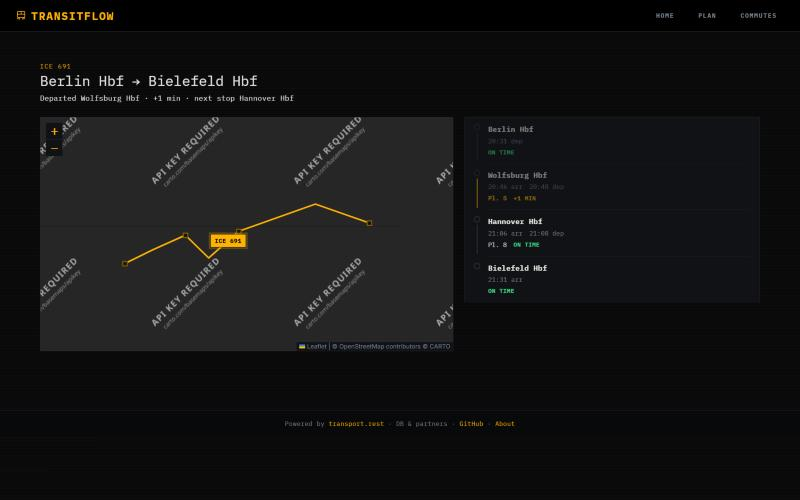

# TransitFlow

TransitFlow is a live departures, journey-planning, and saved-commutes app for the German rail network, built on Deutsche Bahn's open transit API.

**Live demo:** not deployed yet — see [Roadmap](#roadmap).

## Features

- **Live departures board** (`/departures/:stopId`) — a split-flap display where only the digits that actually changed flip, live platform changes pulse amber, and cancellations show struck-through with the reason distinguished from a merely delayed train.
- **Journey planning** — search connections across the full DB network, with a shared, fully keyboard- and screen-reader-accessible station autocomplete.
- **Saved commutes** — one-tap access to a frequent route's journey plan or live departures board.
- **Live trip map** (`/trip/:tripId`) — the route on a dark map with the vehicle's position animated along it in real time (following the actual track geometry, not a straight line between stops), next to a full stopover timeline that dims passed stops and highlights the segment currently being travelled.

## Screenshots

**Departures board** — every state a real board would show: on time, a live delay, a platform change, and a cancellation, all in one screenshot.



**Live trip map** — an ICE mid-route, its marker following the polyline between two stopovers, with the stopover timeline showing the passed, current, and upcoming stops.



## Stack

- **Frontend:** React 19 + Vite, [`@tanstack/react-query`](https://tanstack.com/query) for all server state, `react-bootstrap` for UI, [`react-leaflet`](https://react-leaflet.js.org/) for the trip map (lazy-loaded, its own bundle chunk, off the home page entirely).
- **Backend:** Express, acting as a proxy in front of the upstream transit API.
- **Testing:** Vitest + Testing Library.
- **CI:** GitHub Actions (lint, test, build on every push and PR).

## Architecture

The frontend never calls the transit API directly — every request goes through a small Express proxy in `Backend/`. That indirection isn't incidental; it's there for three concrete reasons.

First, **CORS**. The upstream API ([v6.db.transport.rest](https://v6.db.transport.rest), run by transport.rest) isn't necessarily configured to accept requests from an arbitrary browser origin, and baking that assumption into the frontend is fragile. A server-to-server call sidesteps the question entirely.

Second, **the User-Agent header**. transport.rest's own docs ask clients to identify themselves with a descriptive User-Agent so they can reach out if a client is misbehaving or if something changes upstream. Browsers refuse to let JavaScript set that header on `fetch` requests — it's on the forbidden header list — so a real, honest User-Agent can only be sent from a server we control.

Third, and most important operationally: **the API rate-limits per client IP**. On a free-tier deployment, every visitor to the app shares one outbound IP, so without a cache sitting in front of the upstream API, a moderately popular page could trip the rate limit for everyone using the app, not just the one user who triggered it. `Backend/routes.js` caches each allowlisted route's response by its upstream URL with a per-route TTL, so five people looking at the same station's departures within that window cost one upstream request, not five — that's the difference between a client-side inconvenience and a shared outage. That same file is also the CORS/allowlist boundary: each route declares its exact upstream path template and which query parameters it forwards, so the proxy can't be used as an open relay to arbitrary upstream endpoints the way the original wildcard `/api/*` route could be.

## Local setup

**Backend** (`Backend/`):

```bash
cd Backend
npm install
npm start
```

Runs on port `5000` by default. Set `PORT` to change it.

**Frontend** (`Frontend/`):

```bash
cd Frontend
npm install
npm run dev
```

The Vite dev server proxies `/api` to `http://localhost:5000`, so with both halves running locally there's nothing else to configure. To point the frontend at a different backend (e.g. a deployed one), copy `Frontend/.env.example` to `Frontend/.env` and set `VITE_API_BASE_URL`.

## Deployment

**Frontend (Vercel):**
- **Root Directory** must be set to `Frontend` — the app lives in a subdirectory, not the repo root, and Vercel won't find it otherwise.
- **`VITE_API_BASE_URL`** must be set as an environment variable, to the deployed backend's `/api` URL (e.g. `https://your-backend.onrender.com/api`). If it's left unset, `api.js` falls back to `/api`, which on a deployed frontend resolves against the frontend's own origin — there's no backend there. The build succeeds and the app loads fine; it's only once a user tries to search for a station or load departures that every single request 404s. That gap between "looks deployed" and "actually works" is exactly the kind of thing worth setting explicitly rather than trusting the fallback.
- `Frontend/vercel.json` adds an SPA fallback rewrite (`/(.*)` → `/index.html`). The app uses `BrowserRouter`, so without this, Vercel has no static file at `/plan` or `/commutes` to serve — loading either route directly, or just refreshing on one, 404s. Only `/` would work.

**Backend (Render):**
- **Root Directory:** `Backend`.
- **Start Command:** `npm start`.
- **Environment variables** (see `Backend/.env.example`):
  - **`ALLOWED_ORIGINS`** — comma-separated list of browser origins allowed to call the proxy. Must include the deployed frontend's origin, or the backend's CORS policy rejects every request from it — the frontend loads, but every API call fails as a CORS error rather than a 404, which is a different failure mode worth recognizing if it comes up.
  - `PORT` — Render sets this automatically; the app defaults to `5000` if it's unset.
  - `BASE_API`, `USER_AGENT`, `RATE_LIMIT_PER_MINUTE`, `UPSTREAM_TIMEOUT_MS` — all optional, sensible defaults baked in; only set these to change the upstream API, the identifying User-Agent, the per-IP rate budget, or the upstream timeout.

## Roadmap

This was a staged rebuild of an earlier fetch-wrapper version of this project into something that reads as a product — a split-flap departure board UI and live map/trip tracking were the end goal. The full plan, stage by stage, with what each one changes and why, lives in [`docs/build-plan.md`](docs/build-plan.md).

**Complete:**
- **Stage 0** — repo hygiene: stopped tracking `node_modules` and committed zips, moved config out of source, added a Vitest test runner, and got CI green.
- **Stage 1** — fixed six real bugs, closed out CI, and folded the lessons from doing so back into the build plan for later stages.
- **Stage 2** — replaced the open wildcard proxy with an allowlisted one: fixed upstream routes, per-route response caching, and an `ALLOWED_ORIGINS` CORS policy.
- **Stage 3** — the split-flap design system: tokens, fonts, the `SplitFlap` component, applied to the app shell.
- **Stage 4** — restyled every remaining component and collapsed three duplicated station pickers into one shared, accessible `StationAutocomplete`.
- **Stage 5** — the live departures board: filterable, live-polling, with the platform-change pulse and full loading/empty/error/rate-limited states.
- **Stage 6** — the live trip map: real-time vehicle position that follows the actual route polyline (falling back to a straight line when it can't), next to a full stopover timeline.
- **Stage 8** — this ship pass: accessibility fixes, performance work, and this README.

**Cut:**
- **Stage 7** (nearby radar) — an optional second map surface, dropped to prioritize shipping over an additional visualization. See `docs/build-plan.md` for what it would have been.

## Known limitations

- **The map's dark tiles currently show a CARTO watermark.** The free `{s}.basemaps.cartocdn.com` tile endpoint this app uses now renders an "API key required" overlay across the basemap — a change on CARTO's end since this stage of the project was planned, not a bug here. The route line, stop markers, and vehicle position all still render correctly on top of it; only the background map tiles themselves are degraded. Fixing this means either registering a CARTO API key or switching tile providers.
- **Not deployed yet.** No live URL, and no Lighthouse run against one — see the Roadmap above.
- **No end-to-end or visual regression tests.** Coverage is unit/component-level (Vitest + Testing Library) for the pure logic (formatting, delay math, vehicle-position interpolation) and component behavior; nothing drives a real browser in CI.
- **The map itself has no bespoke screen-reader treatment.** The adjacent stopover timeline is the deliberate text equivalent (same data, fully operable), rather than trying to make the Leaflet widget itself meaningfully narratable.
- **The backend's in-memory cache is bounded by entry count, not bytes.** A trip with a long, detailed polyline costs the same one cache slot as a small departures response — on a small instance, enough large trip payloads cached at once could pressure memory in a way an entry-count limit alone won't catch.
- **A rate-limited (429) request is retried without honoring `Retry-After`.** The backoff is exponential with jitter, but it doesn't read the header the upstream API may send saying exactly how long to wait, so a retry can still land before the API is ready to answer it.
- **The vehicle's position follows the route polyline approximately, not exactly.** It works by finding the polyline vertex nearest each stop and walking the track between them — on a route that loops back through the same geographic area (some regional and tram lines do), the nearest-point match can pick the wrong pass through that area, putting the marker on a visually plausible but wrong segment.
- **The station autocomplete also returns addresses and POIs, not just stops.** Only stops carry the fields (an id journeys/departures can use) that the rest of the app expects — selecting an address or POI result doesn't error, but doesn't behave correctly downstream either.

## Engineering notes

A couple of the Stage 1 fixes are worth calling out on their own, because they're the kind of bug that looks fine in a code review and only shows up once you think about what actually happens at the edges.

**The retry loop could return `undefined` instead of failing.** The original fetch wrapper retried on HTTP 429 (rate limited), but the loop had no `throw` waiting at the end of it — if every retry came back rate-limited, the `for` loop simply ran out of iterations and the function fell off the end, implicitly returning `undefined`. Every call site treated that as "no data" (`data?.departures || []`), so a rate-limited station and an empty station were indistinguishable in the UI. The fix makes the final attempt rethrow explicitly, with a trailing `throw lastError` after the loop that should be unreachable — a small, deliberate insurance policy against the function ever silently resolving to nothing again.

**Every transit icon was wrong, silently.** `getProductIcon` was written assuming `line.product` was an object with `.type`/`.name` fields, and picked an icon by testing substrings like `t.includes('s')` for S-Bahn. In reality, the DB API sends `product` as a plain string (`"nationalExpress"`, `"suburban"`, `"bus"`, etc.), so `.type` and `.name` were always `undefined`, the substring being tested was always empty, and every single journey leg rendered the same fallback icon regardless of mode. It never threw, never showed up in a log — it just quietly looked wrong for every train, tram, and bus in the app. The Stage 1 fix replaced the substring guessing with an exact lookup keyed on the actual product id; `getProductIcon` was later deleted outright, once a recurring color-emoji-in-the-UI problem made the case for the line pill's own text (`ICE 691`, `S7`) carrying that information instead of an icon at all.
