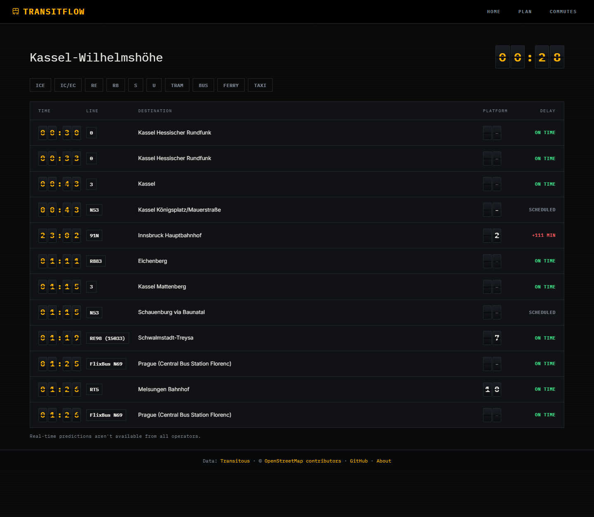
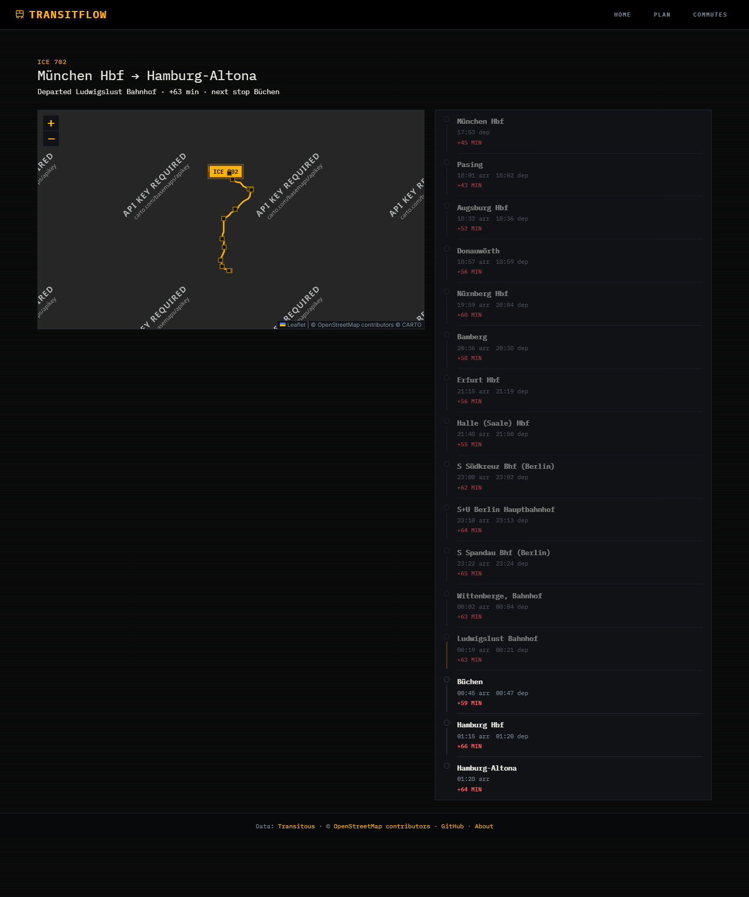

# TransitFlow

TransitFlow is a live departures, journey-planning, and saved-commutes app for German public transport, built on [Transitous](https://transitous.org) open transit data.

**Live demo:** <https://german-api-project-frontend.onrender.com> — the backend is on Render's free tier, so the first request after an idle spell can take about 20 seconds while it wakes up.

## Features

- **Live departures board** (`/departures/:stopId`) — a split-flap display where only the digits that actually changed flip, live platform changes pulse amber, and cancellations show struck-through, distinct from a merely delayed train. Departures with no real-time prediction (most buses and trams) read SCHEDULED rather than a false on-time.
- **Journey planning** — search connections across Germany, with a shared, fully keyboard- and screen-reader-accessible station autocomplete.
- **Saved commutes** — one-tap access to a frequent route's journey plan or live departures board.
- **Live trip map** (`/trip/:tripId`) — the route on a dark map with the vehicle's position animated along it in real time (following the actual track geometry, not a straight line between stops), next to a full stopover timeline that dims passed stops and highlights the segment currently being travelled.

## Screenshots

Both are real Transitous data captured at 1440px wide, not mocked fixtures (captured just after midnight, German time).

**Departures board** — Kassel-Wilhelmshöhe, with the mix a real board has: on time, a real delay, and SCHEDULED for departures that have no real-time prediction. The line under the board says why.



**Live trip map** — ICE 702 from München to Hamburg-Altona, running 63 minutes late. The marker sits on the route between Ludwigslust and Büchen, passed stops are dimmed, and the next ones are bright. (The grey map background and "API key required" watermark are the CARTO tile issue described under Known limitations.)



## Stack

- **Frontend:** React 19 + Vite, [`@tanstack/react-query`](https://tanstack.com/query) for all server state, `react-bootstrap` for UI, [`react-leaflet`](https://react-leaflet.js.org/) for the trip map (lazy-loaded, its own bundle chunk, off the home page entirely).
- **Backend:** Express, acting as a proxy in front of Transitous, which it reaches in-process through [`motis-fptf-client`](https://github.com/motis-project/motis-fptf-client) (pinned to a commit; it isn't published to npm). An adapter layer normalises every response before it is cached.
- **Testing:** Vitest + Testing Library.
- **CI:** GitHub Actions (lint, test, build on every push and PR).

## Architecture

The frontend never calls the transit data source directly — every request goes through a small Express proxy in `Backend/`. That indirection isn't incidental; it does four concrete jobs.

**It keeps the User-Agent honest.** Transitous's usage policy requires every client to identify itself with a name, a version and a way to contact its author, and browsers won't let JavaScript set that header on `fetch`, so it can only be sent from a server we control. The same policy asks for light, user-driven traffic: this app only ever requests data because a person asked for it, and never polls on a timer.

**It shares one cache.** On a free-tier deployment every visitor shares one outbound IP, so five people looking at the same station's departures within the cache TTL should cost one upstream request, not five. `Backend/routes.js` declares each allowlisted route's inputs, validation and TTL; the cache key is the route, its path parameters and its allowlisted query parameters. That file is also the security boundary: a parameter that isn't listed there never reaches the data source, so the proxy can't be used as an open relay.

**It normalises, and does so before caching.** `Backend/adapters/transitous.js` turns Transitous's responses into the shape the frontend reads, and the cache only ever holds the normalised result. Three things in the raw data would otherwise be wrong on screen, each found by running real responses through the app:
- *"No prediction" is encoded as a null `delay` with `when` equal to the planned time.* Left alone, 128 of 204 departures in the saved Berlin Hbf sample would show as confidently on time. The adapter converts it to a null live time, so they read SCHEDULED. A test runs that real sample end to end.
- *A trip's route is ~1 MB, almost all of it map points.* A long-distance trip carries about 12,000 points. The adapter downsamples the polyline (Ramer–Douglas–Peucker, 30 m tolerance, always keeping the vertex nearest each stop): 12,110 points and 1,018,479 bytes became 616 points and 65,966 bytes (94% smaller), with no original point more than 30 m from the simplified line.
- *A trip's `stopovers` leave out its origin and destination.* Without them the vehicle would wait at the first intermediate stop. On one real trip the first three intermediate stops were cancelled, so the vehicle would have waited at Nürnberg for a train that starts in München. The adapter adds both endpoints.

**It isolates the dependency.** `motis-fptf-client` runs inside this server — not as a second service — so there is one deployment and one cold start. A second free-tier service waking up behind this proxy's upstream timeout would fail the first request after every idle period. Measured in-process: ~137 MB resident memory (about 96 MB without station enrichment, which is off), and ~0.2 s for a trip call.

Station ids are the other thing the proxy can't paper over: Transitous ids are long, feed-prefixed, and not durable, so the frontend looks stations up by name instead of trusting a saved id. See [`docs/data-sources.md`](docs/data-sources.md) for the evidence behind all of this, and why Transitous was chosen over the alternatives (partly on its terms of use).

## Local setup

**Backend** (`Backend/`):

```bash
cd Backend
npm install
npm start
```

Runs on port `5000` by default. Set `PORT` to change it.

**Frontend** (`Frontend/`):

```bash
cd Frontend
npm install
npm run dev
```

The Vite dev server proxies `/api` to `http://localhost:5000`, so with both halves running locally there's nothing else to configure. To point the frontend at a different backend (e.g. a deployed one), copy `Frontend/.env.example` to `Frontend/.env` and set `VITE_API_BASE_URL`.

## Deployment

**Frontend (Render static site, auto-deploys from `main`):**
- **Root Directory** must be set to `Frontend` — the app lives in a subdirectory, not the repo root. Build with `npm install && npm run build` and publish `dist`.
- **An SPA rewrite rule must be set in the Render dashboard — it is not a file in this repo.** The app uses `BrowserRouter`, and a static host has no file at `/about`, `/commutes` or `/departures/…`, so without the rule loading any of those directly (a shared link, or a refresh) returns a plain `Not Found`; only `/` works. The rule is a dashboard setting, which means nothing in the code shows that it exists, and it is lost if the service is recreated:

  | Source | Destination | Action |
  |---|---|---|
  | `/*` | `/index.html` | **Rewrite** |

  It must be **Rewrite**, not Redirect — a redirect would send every URL to the home page and drop the path. To check it, load `/about` directly in a fresh tab: it should show the About page, not `Not Found`.
- **`VITE_API_BASE_URL`** must be set as an environment variable, to the deployed backend's `/api` URL (e.g. `https://your-backend.onrender.com/api`). If it's left unset, `api.js` falls back to `/api`, which on a deployed frontend resolves against the frontend's own origin — there's no backend there. The build succeeds and the app loads fine; it's only once a user tries to search for a station or load departures that every single request 404s. That gap between "looks deployed" and "actually works" is exactly the kind of thing worth setting explicitly rather than trusting the fallback.
- `Frontend/vercel.json` holds the same rewrite for **Vercel**, which reads it. **Render ignores this file** — it does nothing for the current deployment. It's kept so the app can move to Vercel without rediscovering the problem; the Render rule above is the one that matters today.

**Backend (Render):**
- **Root Directory:** `Backend`.
- **Start Command:** `npm start`.
- **Environment variables** (see `Backend/.env.example`):
  - **`ALLOWED_ORIGINS`** — comma-separated list of browser origins allowed to call the proxy. Must include the deployed frontend's origin, or the backend's CORS policy rejects every request from it — the frontend loads, but every API call fails as a CORS error rather than a 404, which is a different failure mode worth recognizing if it comes up.
  - `PORT` — Render sets this automatically; the app defaults to `5000` if it's unset.
  - `USER_AGENT`, `RATE_LIMIT_PER_MINUTE`, `UPSTREAM_TIMEOUT_MS` — all optional, with sensible defaults. If you fork this project, change `USER_AGENT` to identify yourself: Transitous's policy requires a name, version and contact.
  - The build must be able to fetch `motis-fptf-client` from `codeload.github.com` (it's installed from a commit-pinned tarball with an integrity hash, not from npm). Render's build environment can.

## Roadmap

This was a staged rebuild of an earlier fetch-wrapper version of this project into something that reads as a product — a split-flap departure board UI and live map/trip tracking were the end goal. The full plan, stage by stage, with what each one changes and why, lives in [`docs/build-plan.md`](docs/build-plan.md).

**Complete:**
- **Stage 0** — repo hygiene: stopped tracking `node_modules` and committed zips, moved config out of source, added a Vitest test runner, and got CI green.
- **Stage 1** — fixed six real bugs, closed out CI, and folded the lessons from doing so back into the build plan for later stages.
- **Stage 2** — replaced the open wildcard proxy with an allowlisted one: fixed upstream routes, per-route response caching, and an `ALLOWED_ORIGINS` CORS policy.
- **Stage 3** — the split-flap design system: tokens, fonts, the `SplitFlap` component, applied to the app shell.
- **Stage 4** — restyled every remaining component and collapsed three duplicated station pickers into one shared, accessible `StationAutocomplete`.
- **Stage 5** — the live departures board: filterable, live-polling, with the platform-change pulse and full loading/empty/error/rate-limited states.
- **Stage 6** — the live trip map: real-time vehicle position that follows the actual route polyline (falling back to a straight line when it can't), next to a full stopover timeline.
- **Stage 8** — the ship pass: accessibility fixes, performance work, and this README.
- **Phase 2, stage 1** — replaced the dead upstream with Transitous (see [`docs/data-sources.md`](docs/data-sources.md)): the proxy now runs `motis-fptf-client` in-process behind a normalising adapter; saved commutes and old links re-resolve stations by name; "Use my location" became "Nearest major station".

**Cut:**
- **Stage 7** (nearby radar) — an optional second map surface, dropped to prioritize shipping over an additional visualization. See `docs/build-plan.md` for what it would have been.

## Known limitations

- **The map's dark tiles currently show a CARTO watermark.** The free `{s}.basemaps.cartocdn.com` tile endpoint this app uses now renders an "API key required" overlay across the basemap — a change on CARTO's end since this stage of the project was planned, not a bug here. The route line, stop markers, and vehicle position all still render correctly on top of it; only the background map tiles themselves are degraded. Fixing this means either registering a CARTO API key or switching tile providers.
- **No Lighthouse run against the live site yet.** The deployed URL hasn't been audited for accessibility or performance.
- **The DB Timetables API isn't used yet.** The application is registered but not subscribed to the API, so every data call returns 403. It's intended for any delay logging, since Transitous's terms rule out continuous polling.
- **No end-to-end or visual regression tests.** Coverage is unit/component-level (Vitest + Testing Library) for the pure logic (formatting, delay math, vehicle-position interpolation) and component behavior; nothing drives a real browser in CI.
- **The map itself has no bespoke screen-reader treatment.** The adjacent stopover timeline is the deliberate text equivalent (same data, fully operable), rather than trying to make the Leaflet widget itself meaningfully narratable.
- **The backend's in-memory cache is bounded by entry count, not bytes.** Downsampling the polyline made a long trip about 66 KB instead of ~1 MB, so this is far less likely to bite — but the bound is still entries, not memory.
- **A rate-limited (429) request is retried without honoring `Retry-After`.** The backoff is exponential with jitter, but it doesn't read the header the upstream API may send saying exactly how long to wait, so a retry can still land before the API is ready to answer it.
- **Most buses and trams have no real-time prediction.** In the saved Berlin Hbf sample all 114 bus and tram departures lacked one, against 14 of 90 rail ones (so 84% of rail had a prediction) — one station at one moment, a hint rather than a measured rate. They show their scheduled time, labelled SCHEDULED.
- **"Nearest major station", not "nearest stop".** Transitous has no nearby-stops lookup, so the button picks the closest of about fifty bundled major stations by straight-line distance, and says so. The coordinates are approximate (within a few hundred metres).
- **Saved commutes whose station can't be matched by name** stay visible, flagged "re-select station", and must be deleted and re-added — there's no edit flow yet. Old `/plan` links that carry old-style station ids aren't migrated.
- **The vehicle marker glides between positions with a 1-second CSS transition, which also applies when the map is zoomed or panned** (and once on load, as the map fits the route), so for a moment the marker can lag behind the route line it sits on. Stage 6 accepted this; it should be limited to tick-driven updates.
- **The vehicle's position follows the route polyline approximately, not exactly.** It works by finding the polyline vertex nearest each stop and walking the track between them — on a route that loops back through the same geographic area (some regional and tram lines do), the nearest-point match can pick the wrong pass through that area, putting the marker on a visually plausible but wrong segment.

## Engineering notes

A couple of the Stage 1 fixes are worth calling out on their own, because they're the kind of bug that looks fine in a code review and only shows up once you think about what actually happens at the edges.

**The retry loop could return `undefined` instead of failing.** The original fetch wrapper retried on HTTP 429 (rate limited), but the loop had no `throw` waiting at the end of it — if every retry came back rate-limited, the `for` loop simply ran out of iterations and the function fell off the end, implicitly returning `undefined`. Every call site treated that as "no data" (`data?.departures || []`), so a rate-limited station and an empty station were indistinguishable in the UI. The fix makes the final attempt rethrow explicitly, with a trailing `throw lastError` after the loop that should be unreachable — a small, deliberate insurance policy against the function ever silently resolving to nothing again.

**Every transit icon was wrong, silently.** `getProductIcon` was written assuming `line.product` was an object with `.type`/`.name` fields, and picked an icon by testing substrings like `t.includes('s')` for S-Bahn. In reality, the DB API sends `product` as a plain string (`"nationalExpress"`, `"suburban"`, `"bus"`, etc.), so `.type` and `.name` were always `undefined`, the substring being tested was always empty, and every single journey leg rendered the same fallback icon regardless of mode. It never threw, never showed up in a log — it just quietly looked wrong for every train, tram, and bus in the app. The Stage 1 fix replaced the substring guessing with an exact lookup keyed on the actual product id; `getProductIcon` was later deleted outright, once a recurring color-emoji-in-the-UI problem made the case for the line pill's own text (`ICE 691`, `S7`) carrying that information instead of an icon at all.
